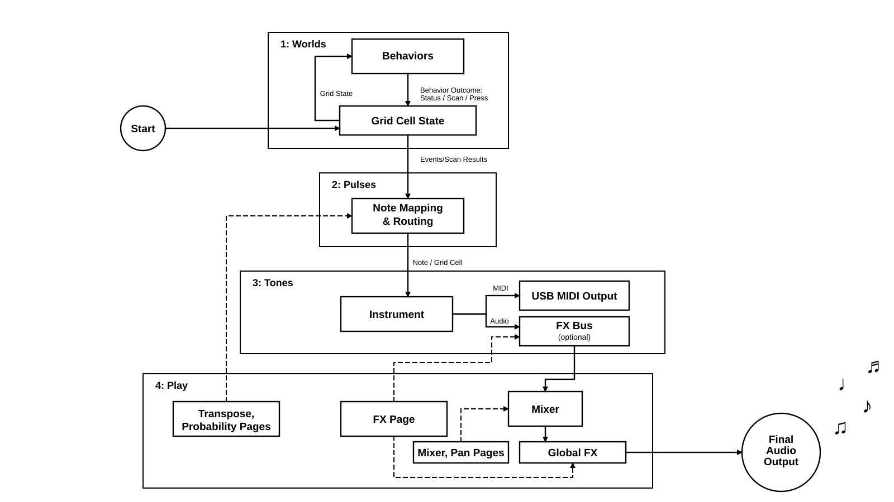

# Controls cheat sheet

This is the map to keep beside the instrument while you learn where everything
lives.

Octessera has regular controls and temporary modes: Play pages, grid assignment
modes, sample assignment, and context help. When in doubt, watch the OLED. It
shows what the controls are acting on.

The performance area is **Play**, with **Play FX** for momentary effects.

## Learn these five controls first

| Learn this | First use |
|---|---|
| *Turn Main* | Move through menus or change the value being edited. |
| *Click Main* | Select, enter, edit, or confirm. |
| *Back* | Leave an edit, overlay, or menu level. |
| *Play* / *Space* | Start or pause playback. |
| Hold *Fn* and use a grid column | Preview layers on the left and Play pages on the right; press a cell to jump there. |

Once these feel familiar, use the exact tables below for stop, reset, binding,
probability, transpose, and Play FX behavior.

## Regular controls

| Control | Area | What it does |
|---|---|---|
| *Turn main encoder* | **Menu navigation** | Navigate the menu, or change the value currently being edited. |
| *Click main encoder* | **Menu selection** | Select menu entries, enter groups, edit values, or confirm actions. |
| *Back* | **Exit current location** | Exit the current edit, leave the current overlay, or go back one menu level. |
| *Play* / *Space* | **Transport** | Play or pause. |
| *Play* / *Space* | **Sample browser preview** | In sample browser menus, preview the highlighted sample. |
| *Shift* + *Play* | **Stop** | Stop playback. In external sync, this arms a one-shot resync at the next 96-PPQN (one-bar) boundary instead of stopping the external clock; playback and the grid continue, then the transport origin resets and the arm clears. |
| *Fn* + *Play* | **Reset stop** | Stop, reset the transport position, and silence Octessera-owned notes. |
| *Fn* + turn main encoder right | **Single step** | While paused or stopped, advance one step/tick. Turning left is a no-op. |
| *Shift* + *Fn* + *Play* | **Reserved** | No action for now. A tiny patch of silence in the shortcut garden. |
| *Shift* + *Back* | **Clear active layer** | Re-initialize the active layer. Very useful. Also very easy to press on purpose only. |
| *Shift* + *Fn* + *click main encoder* | **Context help** | Hold *Shift* + *Fn*, then click a menu item with *Main* to open help for that item. |

Stop, accepted MIDI Start, and resync reset the transport origin, scan, autonomous
Build cadence, Pattern phase, and Looper playback position. They keep evolved
worlds, settings, and the recorded loop. Pause/Continue resumes the exact phase.

## Context help

To use context help, highlight the menu item you want with *Main*, hold *Shift*
and *Fn*, then click *Main*. The OLED opens help for that item. Turn *Main* to
scroll and click *Main* to close it; *Back* also leaves the help display.

Help is specific to the selected menu item, whether it is a parameter, action,
selector, or mode. To read help for another item, close help, highlight that
item, and use the shortcut again. The same shortcuts work on the hardware and
in the simulator.

## Grid navigation shortcuts

| Control | Area | What it does |
|---|---|---|
| *Fn* + left grid column | **Navigate to Layer 1–8** | Jump to the chosen layer. Bottom row is layer 1. |
| *Hold* *Fn* | **Navigation preview** | Left column shows layers: cyan for navigation/current focus, green for configured layers, gray/black for inactive or unavailable cells. Right column shows Play pages in yellow, with the active page in green. |
| *Shift* + *Fn* + left grid column | **Layer trigger toggle** | Toggle that layer's emissions without changing the active layer. |
| *Fn* + right grid column | **Navigate to Play pages** | Jump to *Mix*, *Pan*, *FX*, *Trigger Gate*, *Transpose*, or *XY*. If Play is already active, this exits Play. |
| *Fn* + *aux encoder click* | **Bind focused value/action** | Assign the highlighted menu value to that aux turn, or the highlighted action to that aux click. |

## Aux encoders and auto-map

Auto-map maps *Aux encoders 1–3* to the most important parameters and actions of the menu area you are currently in. It temporarily overrides the manual binding you might have created.

Each *Aux encoder* has two possible bindings:

- **Turn binding**: turning the encoder changes a value.
- **Click binding**: clicking the encoder triggers an action.

You can bind aux controls yourself with *Fn* + *aux encoder click* while a bindable menu item is selected.

How to read OLED markers:

| Marker | Meaning |
|---|---|
| `1-Cutoff` | *Aux 1* turn is bound or auto-mapped to Cutoff. |
| `1!Assign` | *Aux 1* click is bound or auto-mapped to Assign. |
| `1-` and `1!` on one item | That aux has both a turn binding and a click binding in this context. |
| `not active` toast | The binding still exists, but the target is hidden or inactive right now. |

## Cell-to-audio flow

Scanning is optional. If a layer is not scanning, it can still emit events such
as `activate` or direct grid events from `keys` and `looper`.

## Special modes

| Area | What changes |
|---|---|
| Sample assignment | *Shift* + cell maps the whole row. *Shift* + *Fn* + cell maps the whole column. |
| Trigger probability map | Cells set trigger chance for the selected layer: never, low, high, or always. *Shift* + cell maps the whole row. *Shift* + *Fn* + cell maps the whole column. |
| Play Mix | Grid turns into a mixer, where you can change the volume of each layer. |
| Play Pan | Grid lets you move around the layers' stereo position. |
| Play FX | Press mapped cells to trigger live effects. Releasing the cell stops the effect. |
| Play Trigger Gate | Grid lets you quickly block, allow, or use custom probability for each layer's triggers. |
| Play Transpose | Grid lets you temporarily transpose eligible synth and MIDI layers. |
| Play XY | Mappable two-axis surface for live-manipulating parameters. |

## Sample browser

In the sample browser, `..` goes to the parent, `[folder]` opens a folder, file
rows are samples, and `(empty)` means there are no entries. Press *Play* /
*Space* to preview the highlighted sample. Long names clip or scroll without
overlapping other OLED text.

## Tiny survival notes

- The OLED is the truth. If the grid behaves in an unexpected way, you are probably in an overlay or Play page. Take a look at the OLED, and back out using *Back* or navigate away using *Fn*.
- Help is *Shift* + *Fn* + *click main encoder*. I made it a button combination so it is hard to hit by accident.
- If a behavior gets too busy, try probability before you delete the pattern. Let it breathe.
