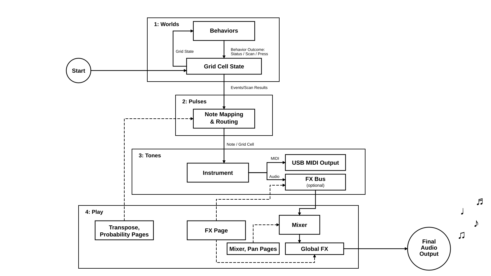

# Sound and Link: from cells to sound

A behavior only moves cells around. Three more stops turn that motion into
music:

1. **Link** decides which cell changes count as notes, which instrument they
   go to, what pitch they get, and what else the grid position steers.
2. **Shape** decides what those notes sound like: the instrument, its sound
   settings, and where its audio goes.
3. **FX buses and Global FX** color the sound on its way to the output.

Every row in these menus has two lines of context help on the instrument
itself. This page is the map; the help is the street view.

## Link: what counts as a note

Each layer has its own Link page (`Link > L1` to `L8`). There are two ways a
layer can make notes, and you can use both at once.

### Events: cells changing state

Under **Events**, three moments in a cell's life can each trigger something:

| Event | When it fires | Usual job |
|---|---|---|
| **On** | A cell becomes active | `note_on` |
| **Hold** | A cell stays active | Often `none`; `note_on` for droning, insistent layers |
| **Off** | A cell turns off | `note_off`, so held notes stop |

Each one picks an **Inst** (instrument slot 1–8), a **Trig** (`none`,
`note_on`, or `note_off`), a **Delay** in layer ticks, and a **Retrig** count
for extra repeats one tick apart. Delay and Retrig are a cheap way to turn one
blip into a little echo figure without touching an effect.

**Event Triggers** switches the whole event path off for a layer without
losing its settings. **State Notes** controls whether the layer also plays
from its current state on every transport tick.

### Scanning: a playhead over the grid

Set **Scan Mode** to `scanning` and the layer gets a moving cursor that sweeps
rows or columns at the **Scan Unit** rate (from `1/32T` up to `1/1`). When the
cursor finds a lit cell it fires the scan action; when it crosses a dark one
it can fire the separate **Empty** action, which is handy for release notes or
a ghostly counter-rhythm. **Sections** splits the sweep into 2, 4, or 8
shorter lanes, so one grid becomes several short loops.

Scanning suits slow, sculptural worlds (`dla`, `coral`, `vines`). Their shape
becomes a sequence instead of a trickle of birth events.

### Note Mapping: which pitches

**Note Mapping** keeps a layer musical:

- **Set** chooses the note collection: Scales (Major, Natural Minor, Dorian,
  and friends), Chord Tones (triads, sevenths, ninths), Pentatonic (including
  Hirajoshi-, In Sen-, and Iwato-like sets), and Symmetric (Whole Tone,
  Octatonic).
- **Root** sets the key.
- **Start Note** is where pitch counting begins.
- **Low Note** and **High Note** fence the range, and **Out of Range**
  decides what happens at the fence: `clamp` stops at the edge, `wrap` folds
  back round.

Chord Tones sets are lovely on busy layers: everything that sounds is part of
one chord, so even chaos sounds like it meant it.

### X and Y: position steers the sound

The **X Axis** and **Y Axis** groups turn where a cell sits into how it
sounds:

- **Pitch Steps** sets how far the pitch moves for each cell along that axis.
  Larger values spread the grid over wider intervals; `Restart Section` starts
  counting again in each scan section.
- **Velocity**, **Filter Cutoff**, and **Filter Res** lanes map position to a
  `From`–`To` range, with a `Curve` and a small `Grid Offs` nudge.
- **Slot 1** and **Slot 2** on each axis can drive *any* mappable parameter
  (an FX mix, a synth's detune, a bus volume), each with an **Invert** toggle.

This is the heart of co-creation. A `boids` flock drifting right can open a
filter while a `wave` on another layer makes the delay bloom.

### Trigger probability: not every time

**Trigger Prob.** decides which triggers get through:

- `full` lets them all through and `zero` blocks the layer.
- `custom` uses a per-cell map, painted with **Map Prob Grid**. Each cell
  cycles zero, low, high, full; Shift paints rows and Shift+Fn paints
  columns.
- **Low Prob** and **High Prob** set what "low" and "high" mean.

Play's **Trigger Gate** page overrides this live without changing what's
saved.

### Arp: notes in a line instead of a lump

When several notes arrive together, **Arp** can spread them out: `up`,
`down`, `bounce`, `outside_in`, `rotating`, `random`, `octave_spread`,
`chord_strike`, or `strum`.

- **Source** chooses between notes arriving in one batch (`simultaneous`) and
  notes the layer is holding (`held`).
- **Step**, **Length ms**, **Gate %**, and **Octaves** shape the run.

### LFOs, tempo, and swing

- **LFOs** gives you eight global sine LFOs, not tied to any layer. Pick a
  **Target** (the list only offers parameters that can be wobbled safely
  while playing), a **Period** in note lengths, and a **Depth**, and let
  things breathe. If another mapping already owns that parameter, the OLED
  says `Mapping rejected`.
- **BPM** sets the tempo.
- **Swing** delays the off-beats of internal steps and scanning, for groove
  without bending the main clock.
- **Seeded** makes trigger probability and random arp orders repeatable; see
  [Seeds](behaviors-and-play.md#seeds-surprises-you-can-keep).

## Shape: what it sounds like

`Shape > Instruments` holds eight instrument slots. Link's **Inst** numbers
point at them.

| Type | What it is | Where to start |
|---|---|---|
| `synth` | Two oscillators into a filter, each with its own envelope | Osc Wave and Octave, then Filter Cutoff and the Filter Env |
| `fm` | A sine carrier and modulator; bells, keys, glassy tones | Tone > Ratio and Index, then Index Env Decay |
| `pluck` (shown as Plucked) | A modelled ringing string | String > Decay, Brightness, and Pick Pos |
| `drum` | An eight-voice kit; cells are assigned to voices | Kit > Load, then **Assign** cells to voices and **Cell Tune** them |
| `sampler` | Up to eight WAV slots; cells are assigned to samples | **Browse** for a sample, then **Assign** it to cells |
| `midi` | Sends notes to external gear instead of making sound | Channel, Velocity, and Duration under Note Settings |

A few things worth knowing:

- **Presets and kits.** FM, Plucked, and the synth have preset loads; Drum and
  Sampler have kit loads. Loading asks first, and only changes that slot.
- **Note Mode.** `oneshot` gives each trigger a finite note. `hold` keeps the
  note sounding until a matching `note_off`, which is what Off events and
  scanned-empty release are for.
- **Drum and Sampler pitch.** They play what's *assigned to the cell*, not
  Link's pitch. Their tuning lives in Cell Tune and Tune, and Play's
  Transpose page leaves them alone.
- **Mixer.** Each slot's **Mixer** sets **Route** (`direct` to the main mix,
  or one of the FX buses), **Volume**, and **Pan Pos**. A slot routed to a bus
  takes its pan from the bus.
- **MIDI on any instrument.** **MIDI > Enabled** makes any instrument also
  send its notes out on a MIDI channel. MIDI never passes through the internal
  effects.

## FX buses: shared effect chains

`Shape > FX Buses` has four buses. Each runs **Slot 1 → Slot 2 → Slot 3** in
order, then its own **Volume** and **Pan Pos**, into the main mix. Send
instruments there with their **Route** setting.

| Type | Does | Type | Does |
|---|---|---|---|
| `delay` | Echoes; time in ms or synced to a note length | `reverb` | Space and tails |
| `chorus` | Doubling shimmer | `flanger` | Swooshing comb filter |
| `vibrato` | Pitch wobble | `tremolo` | Volume pulsing |
| `auto_pan` | Moves the bus around the stereo field | `filter_lfo` | Self-moving filter |
| `wah` | Vocal filter sweep | `glitch` | Stutters |
| `vinyl` | Lo-fi warmth, crackle, and warp | `bitcrusher` | Grit |
| `eq` | Three-band tone shaping (±12 dB) | `compressor` | Evens out levels |
| `saturator` | Soft clipping and warmth | `distortion` | Hard clipping |
| `duck` | Turns this bus down when another instrument or bus is loud | `none` | Passes sound through |

**Duck** is the secret pumping trick. Put a pad on Bus 1 with `duck` sourced
from your kick instrument, and the pad breathes in time.

Choosing a Type loads sensible starting values, so it's safe to try
things. Beyond about twelve active bus effects the instrument warns you: the
little computer inside has limits, and it would rather tell you than crackle.

## Global FX: the finishing touch

`Shape > Global FX` has two slots on the whole mix, after everything is summed:
`vinyl`, `eq`, `compressor`, `saturator`, or `distortion`. A touch of
`saturator` or `compressor` glues the layers together. `distortion` here
affects *everything*, so go gently.

## A patch to try

1. **Layer 1:** `sequencer` → Inst 1 = `drum`. Assign a kick, snare, and hat to
   a few cells.
2. **Layer 2:** `boids` → Inst 2 = `synth`, Route `fx_bus_1`. Note Mapping Set
   = `Minor Pentatonic`; X Axis **Filter Cutoff** on.
3. **Bus 1:** Slot 1 `delay` synced to a note, Slot 2 `duck` sourced from I1.
4. **Link > LFOs > L1:** target Bus 1's delay mix, Period `1/1`, Depth around
   30%.
5. Press **Play**, then open the **XY** Play page and steer it by hand.

The drums anchor the beat, the flock wanders and opens the filter, the delay
gets out of the kick's way, and the LFO keeps the echoes from sitting still.
Then change one thing and listen to what the little worlds do with it.
